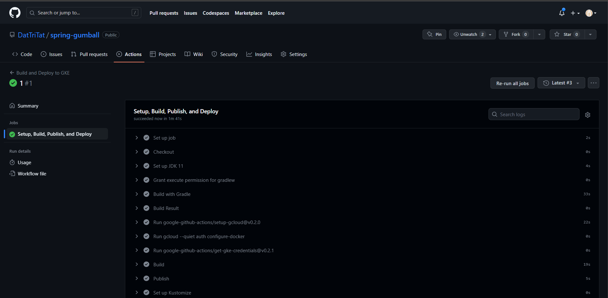
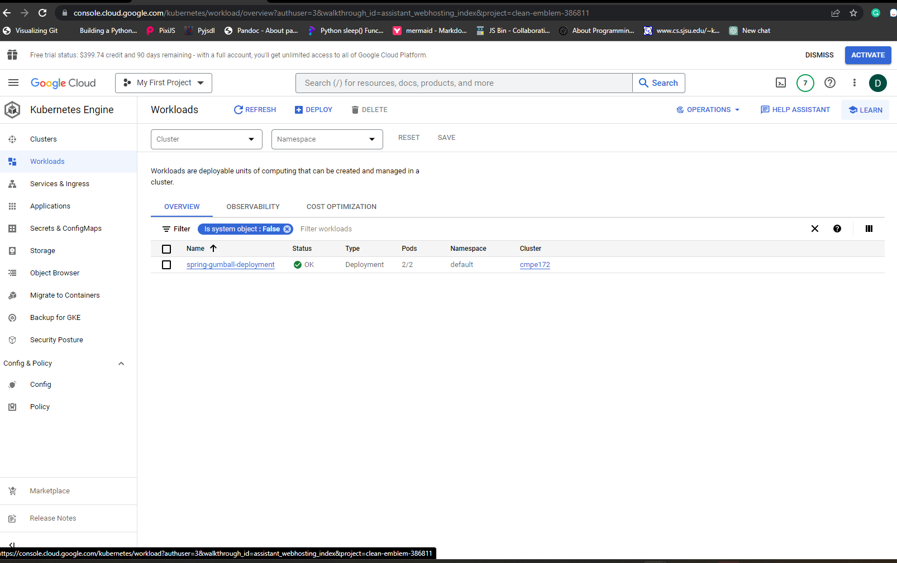

# **LAB10**

# **CI Workflow (Part 1)**

**Create workflow gradle.yml**

**Create workflow google.yml**

**Build workflow**

**Change replicas to 2**

# **CD Workflow (Part 2)**

**Enable APIs**

**Enable APIs**

**Create a Service Account**

**Create key**

**Grant access**

**Add SHA key**

**Add project key**

**Release new action**

**Create kubernetes ingress**

**Create spring-gumball-lb**

**Web UI came up on Load Balancer's External IP**
